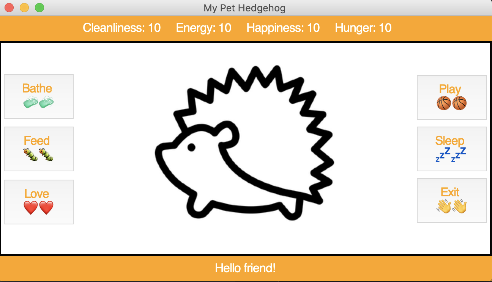

# my_pet_hedgehog
Final project for Code in Place program at Stanford University. 

This program generates an interactive virtual pet hedgehog. There are five
activities to partake in, a status bar that reflects the hedgehog's "mood"
based on four different criteria and a feedback bar that displays the
hedgehog's "feelings".

To start:

    python3 my_pet_hedgehog.py
